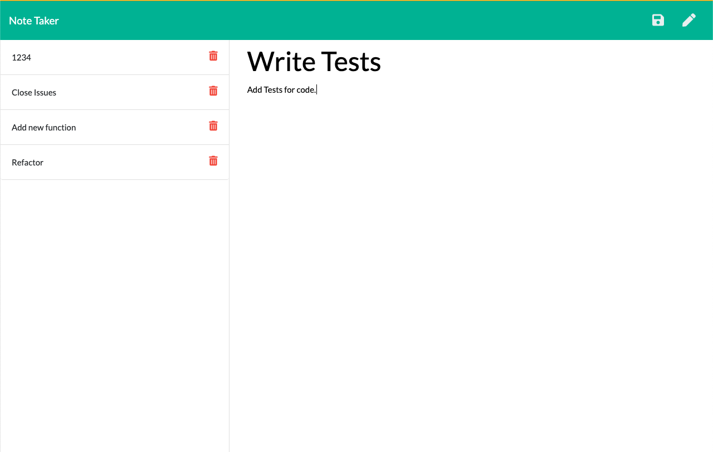

# Express.js Note Taker

## Description

The Project of the week was to connect the frontend of an application to a created back end code. The Note Taker application had given front end code that contaitned HTML, CSS and JS. The task of the challenge was to write back end code that connected these two via routes. The notes also had to be written and stored in an API that could be called on at any time using the application. Back end coding has proven to be a new challenge.

## Table of Contents

* [Installation](#installation)
* [Usage](#usage)
* [License](#license)
* [Contributing](#contributing)
* [Questions](#questions)

## Installation 

Run 'npm i' in the command line to install all the necessary dependencies.

## Usage

Navigate to "https://calm-atoll-07261.herokuapp.com/" to see the live application. Click "get started" and you will be navigated to a web page that allows you to write new notes and also see past notes that have been written. On the right column you can write the title and description of your note and then click save in the upper left hand corner. The note is then displayed in the left hand column and you may click on it to view it at any time. Click on the writing tool in the upper right hand corner to begin writing a new note at any time. If you have completed a specific note, or it is now irrelevant you can click the garbage can to the right of the note and delete it. 

## Licenses

* MIT

## Contributing

* Aaron Centeno

## Technologies Used
* Express
* Node Modules
* GitHub
* JavaScript
* Terminal
* Heroku

## Screenshots

## Questions

Contact Information for questions: 

GitHub: [aaroncenteno](https://www.github.com/aaroncenteno) 

E-mail: asamcent@gmail.com